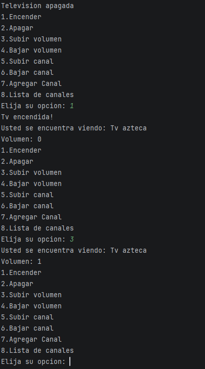

# Actividad-3-POO
3ra Actividad de POO 
Estructura general
El código lo dividí en dos funciones principales: un método auxiliar para mostrar las opciones del menú (opciones()) y el método principal (main()) que gestiona el flujo de control del programa.

Funciones y Lógica
1. Menú de opciones (opciones)
Creé este método simple para imprimir en pantalla las 8 operaciones disponibles y solicitar la entrada del usuario. Al ponerlo en un método separado, mantengo el flujo de main más limpio y evito repetir código.

2. Inicialización del estado inicial
Dentro de main(), instancio el lector de consola (Scanner) y la televisión (Tv). Inmediatamente después, configuro la lista inicial de canales usando el método tv.setChannel() para registrar cuatro canales predeterminados:

Canal 1: Tv azteca

Canal 2: Televisa

Canal 11: Canal once

Canal 12: Canal doce

3. Bucle interactivo (do-while)
Decidí usar un ciclo do-while para asegurar que el menú se muestre al menos una vez y continúe ejecutándose repetidamente hasta que el usuario ingrese la opción 0 para salir.

Evaluación del estado de la TV: Al inicio de cada iteración del bucle, verifico mediante tv.getState() si la televisión está encendida o apagada:

Si está apagada: Muestro el mensaje "Television apagada" seguido del menú de opciones.

Si está encendida: Muestro el canal actual (tv.getChannel()) y el nivel de volumen (tv.getVolumeLevel()), informando al usuario sobre el estado actual antes de mostrar las opciones.

Procesamiento de opciones: Utilizo una estructura condicional if / else if para evaluar la opción elegida (opt) y ejecutar el método correspondiente del objeto tv:

Encender: tv.turnOn()

Apagar: tv.turnOff()

Subir volumen: tv.volumeUp()

Bajar volumen: tv.volumeDown()

Subir canal: tv.channelUp()

Bajar canal: tv.channelDown()

Agregar canal: Solicito el nombre mediante scanner.next() y el número mediante scanner.nextInt(), y luego los registro llamando a tv.setChannel(newChannel, newName).

Lista de canales: Muestro la lista completa llamando a tv.listChannels().

